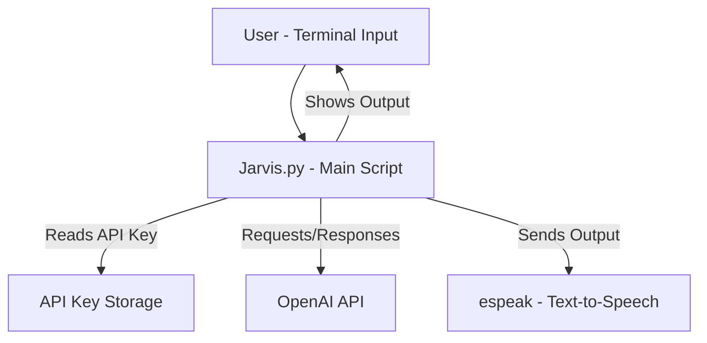

# 🤖 Jarvis AI – ChatGPT-like Assistant in Termux (No Root)

**Jarvis AI** is a simple yet powerful Python-powered virtual assistant designed to work seamlessly in Termux on Android devices. It provides ChatGPT-style conversational intelligence, secure API key handling, and text-to-speech—all within a single script. No root access required!

---

## 🚀 Features

Jarvis AI provides a clean, easy-to-use AI assistant experience on Android. Key features include:

- **ChatGPT-like intelligent responses:** Interact using natural language and receive AI-generated answers.
- **Termux compatibility:** Runs natively in the Termux environment on Android.
- **No Root Required:** Works without the need for device rooting.
- **Secure API Key Handling:** Safely prompts for your OpenAI API key, hiding your input and storing it securely for future use.
- **Text-to-Speech Output:** Uses `espeak` for voice responses, making conversations lively.
- **Beginner-friendly Code:** The single-file script (`jarvis.py`) is easy to read and modify.
- **One-File Setup:** Everything you need is conveniently bundled in `jarvis.py`.

---

## 📦 Requirements

Before using Jarvis AI, ensure you meet these requirements:

- **Termux App:** Latest version installed on your Android device.
- **Python:** Version 3.9 or higher.
- **Internet Connection:** Required for communication with OpenAI.
- **OpenAI API Key:** Obtainable from [OpenAI's API platform](https://platform.openai.com/account/api-keys).

---

## 🔧 Installation

Follow these steps to set up Jarvis AI on Termux:

```bash
pkg update && pkg upgrade
pkg install python git espeak -y
pip install requests
git clone https://github.com/techvyana20-oss/IronMan-Jarvis-Termux.git
cd IronMan-Jarvis-Termux
python jarvis.py
```

- The script will prompt you to enter your OpenAI API key on first run and store it securely.

---

## ▶️ Run Jarvis

To start Jarvis at any time:

```bash
python jarvis.py
```

On the first run, Jarvis will securely ask for your API key and store it locally for future sessions.

---

## ⚠️ IMPORTANT NOTICE | ज़रूरी सूचना

### ❗ English

If you encounter the following error:

```
API Error 429 – insufficient_quota
```

🚫 **THIS IS NOT A CODE ERROR**

❌ Your OpenAI API credits are exhausted or billing is not enabled.

**Solution:**
1. Visit [OpenAI Billing](https://platform.openai.com/account/billing)
2. Add a payment method.
3. Generate a new API key.
4. Restart Jarvis.

---

### ❗ Hindi / Hinglish

Agar aapko yeh error dikhe:

```
API Error 429 – insufficient_quota
```

🚫 **YEH CODE KA ERROR NAHI HAI**

❌ Aapke OpenAI API credits khatam ho gaye hain ya billing enabled nahi hai.

**Solution:**
1. OpenAI Billing page par jaaye.
2. Payment method add kare.
3. Naya API key banaye.
4. Jarvis dobara run kare.

---

## ⚠️ Disclaimer

This project is intended for educational purposes only. You are solely responsible for any API usage and associated costs.

---

## 👨‍💻 Author

Developed and maintained by **TechVyana2.0**

---

## 📜 License

This project is licensed under the **MIT License**.

---

# 🛠️ Usage Overview

Jarvis AI provides a smooth chat experience in Termux, combining secure key handling, OpenAI integration, and voice output. It is ideal for both beginners and advanced users who want a portable AI assistant on Android devices.

---

# 📊 Component Diagram

The following diagram visualizes the core components and their interactions:



---

# 🔒 Secure API Key Handling

- The script uses hidden input prompts to prevent accidental exposure of your OpenAI API key.
- On the first run, the key is saved locally in a protected manner for repeated use.

# 🗣️ Text-to-Speech

- Jarvis uses the `espeak` package to deliver AI responses audibly.
- This enhances accessibility and brings a virtual assistant experience to your Android terminal.

# 💡 Best Practices

```card
{
    "title": "Keep Your API Key Secure",
    "content": "Never share your OpenAI API key. Treat it like a password and reset it if compromised."
}
```

```card
{
    "title": "Monitor Your Usage",
    "content": "Regularly check your OpenAI usage and billing to avoid unexpected charges."
}
```

---

# ❓ Frequently Asked Questions

**Q:** Does this work on iOS or Windows?  
**A:** No. Jarvis AI is designed for Termux on Android only.

**Q:** Is my API key safe?  
**A:** The script hides your API key input and stores it locally. However, you are responsible for its security.

**Q:** What if I get a 429 error from the API?  
**A:** This means your quota is exhausted or billing is not enabled. See the notice above for solutions.

**Q:** Can I use a different TTS engine?  
**A:** This script uses `espeak`, but you can modify it to use another engine if you wish.

---

# 💬 Support and Contributions

- If you find a bug or want to contribute, please [open an issue or pull request on GitHub](https://github.com/techvyana20-oss/IronMan-Jarvis-Termux).
- Feedback and suggestions are welcome!

---

**Enjoy your AI-powered assistant on Android!**